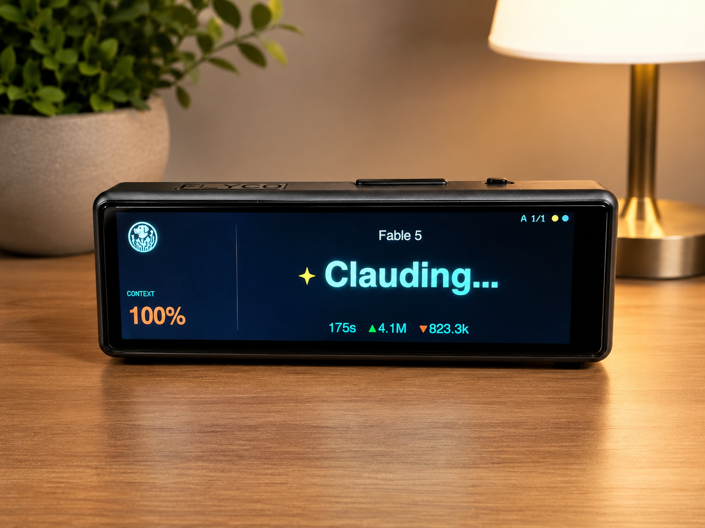
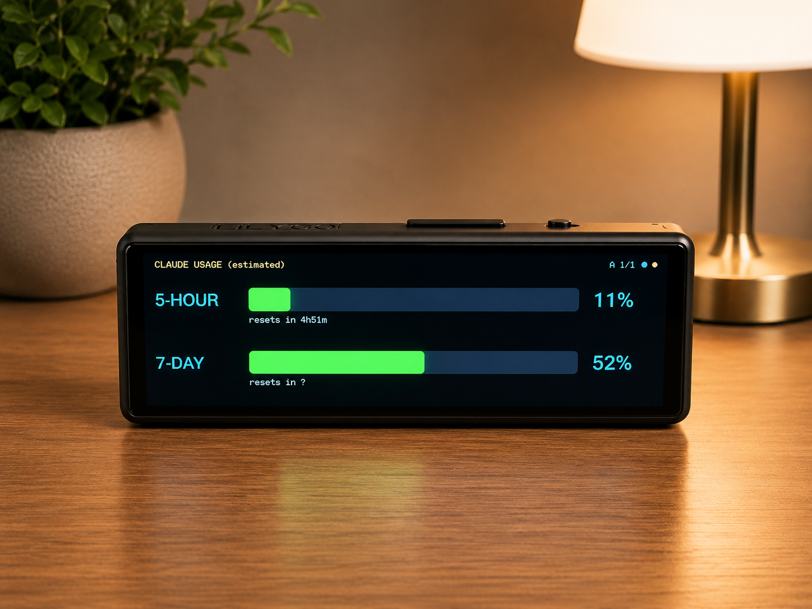
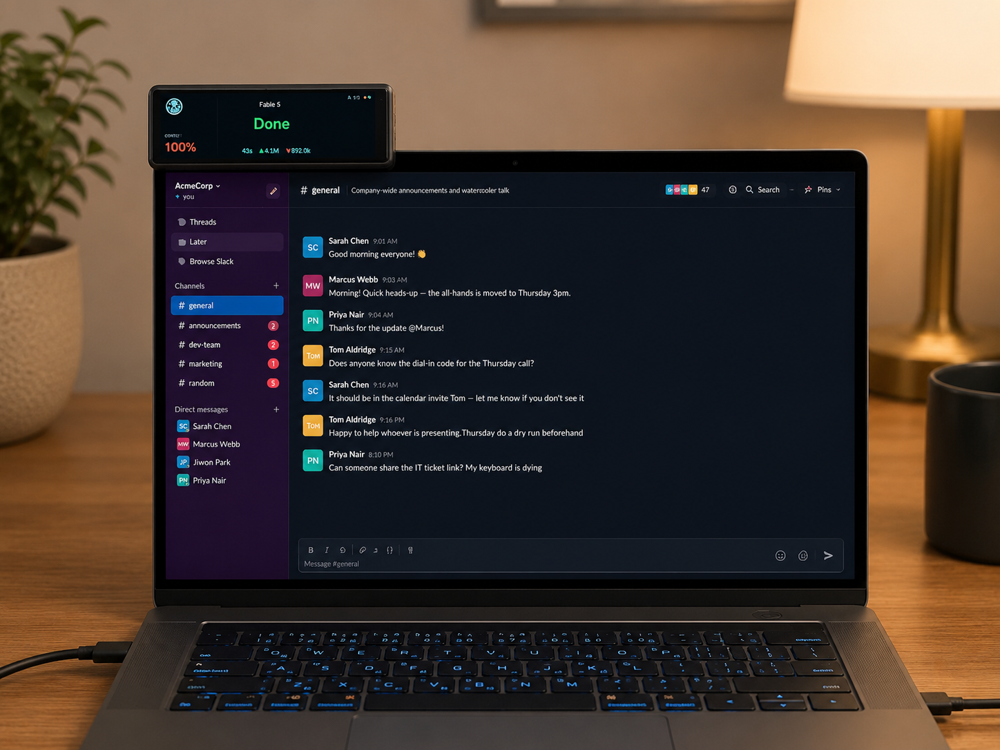

# Claude Status Bar


-orange)
-critical)


A tiny desk display that shows what Claude is doing, live: current model, the tool it's running ("Bash", "Read", "Percolating…"), elapsed time, tokens in/out, context usage, and your 5-hour / 7-day rate-limit bars. Works with **Claude Desktop (Cowork)** and **Claude Code**, up to 4 sessions at once.





Mounts wherever you like - desk stand or perched on top of your monitor. One USB-C cable to your PC is both power and data:



## Hardware

| Part | Notes |
|---|---|
| [LilyGo T-Display S3 Long](https://lilygo.cc/products/t-display-s3-long) | ESP32-S3, 3.4" 640×180 LCD (AXS15231B), capacitive touch, USB-C. ~$25 on AliExpress. |
| USB-C **data** cable | Powers the display and carries the status feed. That's the whole BOM. |

No battery needed — it lives plugged into your PC. (The board has a JST battery connector + charger if you ever want one, but this project streams over USB anyway.)

## How it works

```
Claude Desktop / Claude Code
        │  writes JSONL transcripts on disk
        ▼
bridge/claude_bar_bridge.py   (Python, runs on your PC)
        │  tails transcripts → derives per-session state
        │  + polls Anthropic usage API (real limits) or estimates locally
        ▼  JSON lines over USB serial @ 115200
firmware/claude_statusbar.ino  (ESP32-S3)
        │  renders 640×180 UI, touch + button input
        ▼
your eyeballs
```

The bridge watches these locations (auto-detected per platform; `CLAUDE_CONFIG_DIR` is honored):

- `~/.claude/projects/**/*.jsonl` — Claude Code (all platforms; `%USERPROFILE%\.claude\...` on Windows)
- Claude Desktop / Cowork transcripts:
  - Windows: `%LOCALAPPDATA%\Packages\Claude_*\LocalCache\Roaming\Claude\local-agent-mode-sessions\...` (the MSIX-virtualized path the app actually writes to)
  - macOS: `~/Library/Application Support/Claude/local-agent-mode-sessions/...`
  - Linux: `~/.config/Claude/local-agent-mode-sessions/...`

Per-session state machine: `run` (Clauding…) → `tool` (shows tool name) → `wait` (orange "Waiting on you" — pending permission or Claude asked a question) → `done` / `idle`. Sessions auto-follow the most recently active one, but jump to any session that's waiting on you, with an orange alert banner.

## Setup

Works on **Windows, macOS, and Linux**. New board? It ships with LilyGo's factory demo (a "smart config / ESPTouch / xinyuandianzi" WiFi screen) — ignore it; step 1 flashes right over it.

**Prereq:** Python 3.10+ ([python.org](https://python.org); on Windows check "Add to PATH").

1. **Flash the firmware** — plug the display in via USB-C, then from `firmware/`:

   - **Windows** (PowerShell): `powershell -ExecutionPolicy Bypass -File .\build_and_flash.ps1` (add `-Port COM5` if the wrong port is picked)
   - **macOS / Linux**: `./build_and_flash.sh` (add `--port /dev/ttyACM0` to override)

   Fully self-contained: downloads arduino-cli, the ESP32 toolchain (~1.5 GB, first run only), LilyGo's official display driver, and all libraries into `C:\ClaudeBarBuild` / `~/ClaudeBarBuild`, then compiles and flashes. If upload fails: hold **BOOT** while plugging in USB, release, retry.

   **Linux one-time setup:** `sudo usermod -aG dialout $USER` (then log out/in). If the serial port vanishes when you plug in, remove the port-grabbing screen-reader daemon: `sudo apt remove brltty`.

2. **Test:** `bridge\run_bridge.bat --demo` (Windows) / `bridge/run_bridge.sh --demo` (Mac/Linux) — fake data, verifies the whole pipeline.

3. **Run the app:** `bridge\run_app.bat` / `bridge/run_app.sh` — a small desktop app that runs the bridge with a **live preview of the display**, a **logo uploader** (pick any JPG/PNG; it's converted to 48×48, streamed to the device, and saved in its flash — try the 15 ready-made icons in `logos/starter-pack`), **minimize-to-system-tray**, and a **start at login** checkbox. Prefer headless? `run_bridge.bat` / `run_bridge.sh` runs the bare console bridge (`install_autostart.bat` on Windows starts it hidden at login) and `set_logo.bat` / `set_logo.sh` uploads a logo from the command line. On Mac/Linux the app needs tkinter: `brew install python-tk` / `sudo apt install python3-tk`.

## Customize the badge

The image in the top-left corner of the screen is yours to change: open the app → **Set logo…** → pick any JPG/PNG (your company logo, avatar, pet, whatever). It's converted to 48×48, sent to the display, and saved in the device's flash so it survives reboots. A starter pack of 15 ready-made icons ships in `logos/starter-pack` — sparkles, terminal, robot, space invader, coffee, and friends. `Clear logo` in the app removes it.

## Controls

| Action | Result |
|---|---|
| Tap screen | Switch page (status ↔ usage) |
| BOOT button, short press | Cycle session (A/B/C/D) |
| BOOT button, hold 1s | Flip display 180° (saved) |

After a tap the screen needs a couple of seconds before the next tap registers — see [docs/HOW_IT_WORKS.md](docs/HOW_IT_WORKS.md) for why (touch hardware quirk).

## Usage limits page

If you're logged into Claude Code, the bridge reads your **real** 5-hour/7-day utilization and reset times from Anthropic's usage API (refreshed every 60s). Credentials come from `~/.claude/.credentials.json` (Windows/Linux) or the login Keychain (macOS). Otherwise it shows a local estimate from transcript token counts — tune `est_cap_5h_tokens` / `est_cap_7d_tokens` in `bridge\config.json` (copy from `config.example.json`).

## Configuration

Copy `bridge\config.example.json` → `bridge\config.json`. Everything is optional: serial port override, context window size (set `1000000` for 1M-context plans), idle/wait timing thresholds, usage caps, extra transcript roots.

## Troubleshooting

| Symptom | Fix |
|---|---|
| "Bridge offline" on display | Bridge not running, or wrong port: `run_bridge --port COM5` (Windows) / `--port /dev/ttyACM0` (Linux) / `--port /dev/cu.usbmodemXXXX` (Mac) |
| "No sessions" | `run_bridge --scan` shows which transcripts were found |
| Linux: permission denied on port | `sudo usermod -aG dialout $USER`, log out/in |
| Linux: port disappears on plug-in | `sudo apt remove brltty` |
| Blue/orange colors swapped | Set `SWAP_BYTES 0` in the .ino, re-run build script |
| Display upside down | Hold BOOT ~1s |
| Flash fails | Hold BOOT while plugging USB, release, retry |
| Compile error | Open an issue with the error text |

## Project structure

```
firmware/
  build_and_flash.ps1        one-click toolchain + build + flash (Windows)
  build_and_flash.sh         same, for macOS / Linux
  claude_statusbar/          Arduino sketch (driver files auto-copied by script)
bridge/
  claude_bar_app.py          desktop app: bridge + live preview + tray + logo UI
  claude_bar_bridge.py       core bridge (transcript tailer + serial feeder)
  set_logo.py / .bat / .sh   command-line logo uploader (48x48 RGB565)
  run_app.bat / .sh          launch the desktop app
  run_bridge.bat / .sh       headless console bridge
  install_autostart.bat      headless autostart at login (Windows)
  config.example.json
docs/
  HOW_IT_WORKS.md            architecture + hardware quirks (worth reading!)
```

## License

MIT — see [LICENSE](LICENSE).
